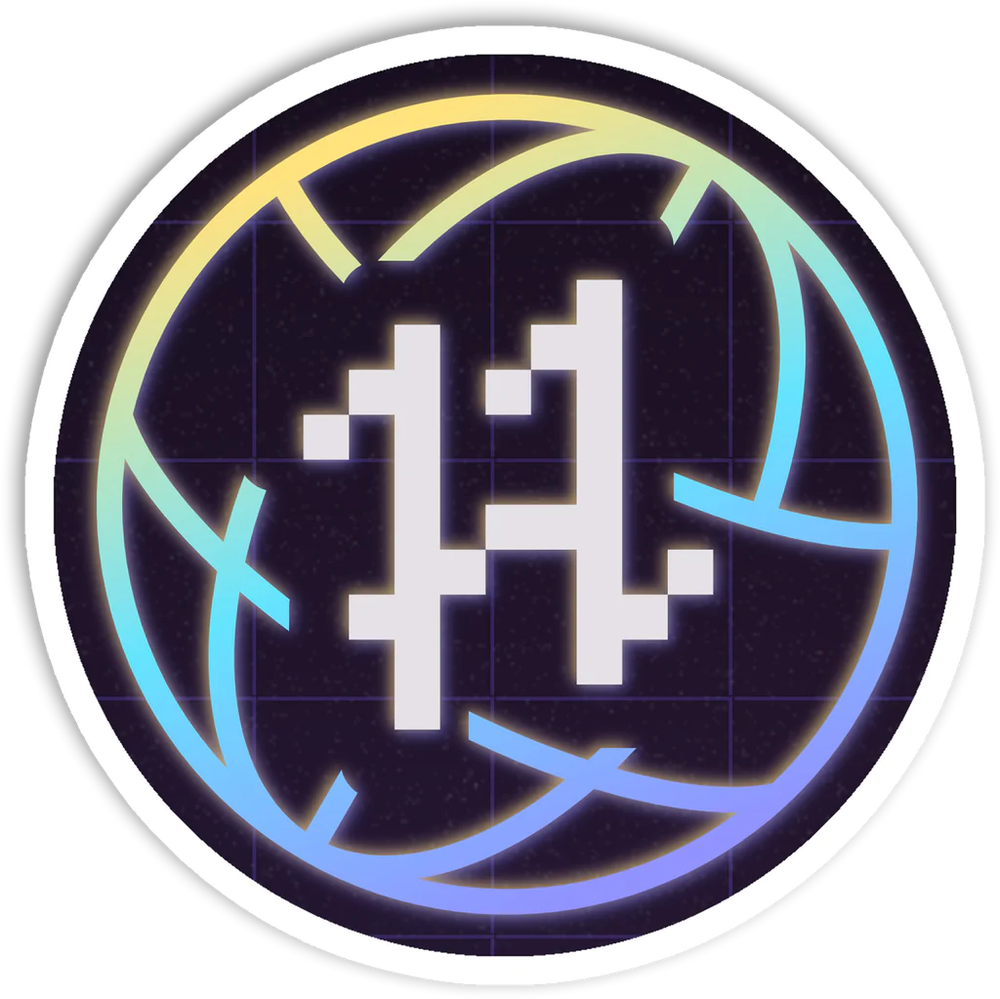

<h2>Hi :wave: I'm Ryan Goodwin! </h2>

<p><em>Lead Programmer/Analyst at the <a href="https://sicas.suny.edu">SUNY SICAS Center</a></em></p>

<!-- [](https://www.twitter.com/Ryan_Goodwin_) -->
[](https://www.linkedin.com/in/ryan-goodwin-2b396b161/)
[](https://www.github.com/CGBassPlayer)
[](https://matrix.to/#/@cg_bassplayer:matrix.org)

## :man_technologist: About Me

```yaml
CG_BassPlayer:
  personal:
    pronouns:
      - he
      - him
    hobbies:
      - name: Homelab
        description: Lab to learn new tools and services
      - name: 3D printing
  technical:
    os:
      - Pop!_OS
      - Ubuntu
      - Windows
    programming:
      - lang: Java
        frameworks:
          - JAXB
          - Apache POI
      - lang: Python
        frameworks:
          - FastAPI
          - playwight
          - pyTest
      - lang: Javascript
        frameworks:
          - ReactJS
    databases:
      - Oracle
      - MSSQL
      - Postgres
    tools:
      ides:
        - IntelliJ
        - PyCharm
        - VS Code
      technologies:
        - Docker
        - GitHub Actions
        - Ansible
        - Terraform
```

## :heart: My Open Source Contributions

<a href="https://github.com/JupiterBroadcasting/jupiterbroadcasting.com">
    
</a>
<a href="https://github.com/OpenLightingProject/open-fixture-library">
    
</a>
<a href="https://github.com/microsoft/playwright-pytest">
    
</a>
<a href="https://github.com/JupiterBroadcasting/show-scraper">
    
</a>
<a href="https://github.com/juliushaertl/nextcloud-docker-dev">
    
</a>
<a href="https://github.com/CGBassPlayer/zeronote-docker">
    
</a>

## :star2: Badges
[](https://holopin.io/@cg_bassplayer)
<div>
    <a href="https://dev.to/cg_bassplayer"></a>
</div>

## :bar_chart: Stats

<div>
    
    
    
</div>
